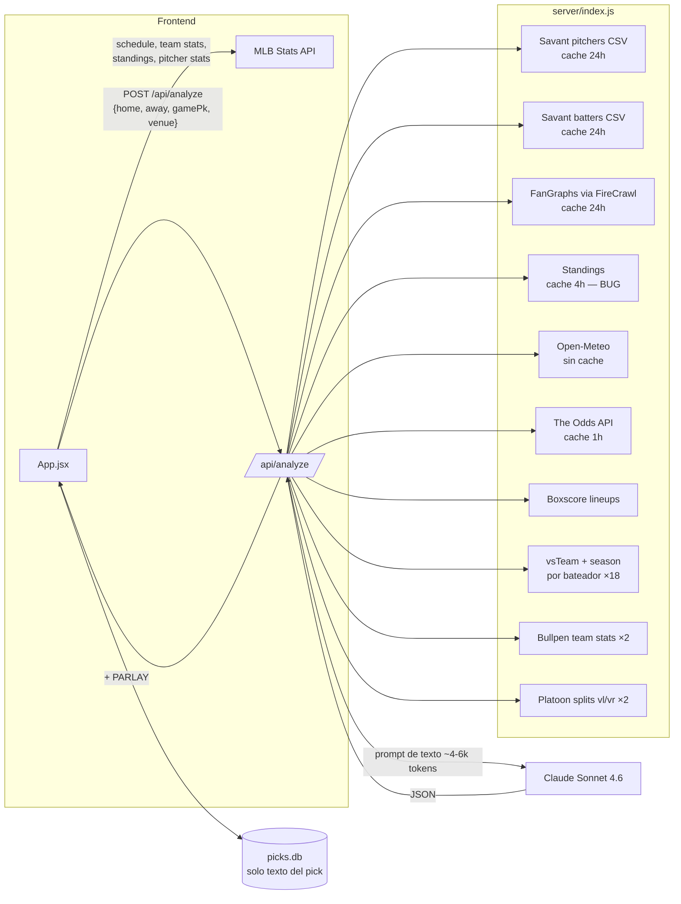
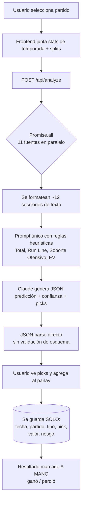
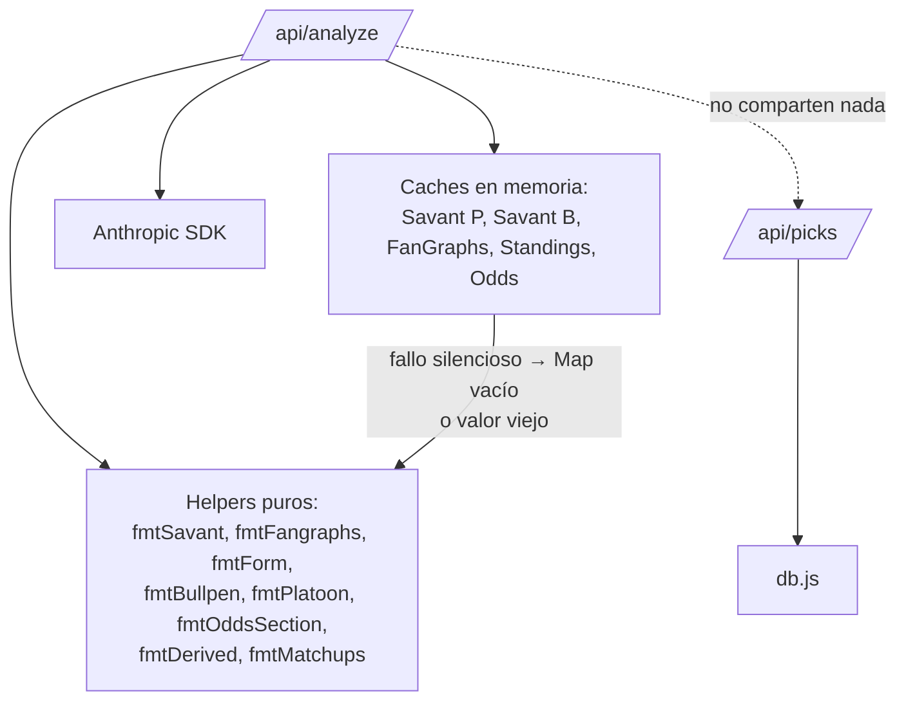

# Auditoría del Sistema Moneyball — Diamond Edge

**Fecha:** 2026-07-02 · **Auditor:** Claude (Fable 5) · **Alcance:** repositorio completo
**Veredicto corto:** el sistema es un *recolector de contexto excelente* acoplado a un *motor de predicción no verificable*. La mayor debilidad no es la calidad de los datos — es que **no se guarda nada de lo necesario para saber si los picks son buenos**: ni probabilidades, ni cuotas al momento del pick, ni versión de la lógica. El 61.6% de aciertos histórico es un número sin denominador económico.

---

## 1. Arquitectura encontrada

| Capa | Tecnología | Archivos |
|---|---|---|
| Frontend | React 19 + Vite 8 | `src/App.jsx`, `src/components/*` (6 componentes), `src/utils.js` |
| Backend | Express 5 (ESM), puerto 3001, sirve `dist/` estático | `server/index.js` (~790 líneas, monolito) |
| Persistencia | better-sqlite3, una tabla `picks` | `server/db.js`, `server/picks.db` |
| Motor de predicción | Claude `claude-sonnet-4-6` vía prompt de texto | dentro de `/api/analyze` |
| Datos externos | MLB Stats API, Baseball Savant (CSV), FanGraphs (vía FireCrawl), Open-Meteo, The Odds API | funciones de fetch en `server/index.js` |

### 1.1 Flujo de datos

### 1.2 Proceso de generación de picks

### 1.3 Dependencias entre módulos

**Observación estructural:** `/api/analyze` y `/api/picks` no comparten ningún dato. El análisis (probabilidades, cuotas, contexto) se descarta al terminar el request; el pick guardado es solo texto. Esta desconexión es la causa raíz de que no se pueda medir nada.

---

## 2. Origen y transformación de cada estadística

| Sección del prompt | Fuente | Transformación | Falla silenciosa |
|---|---|---|---|
| LANZADORES PROBABLES | MLB API season stats (frontend) | ninguna | "sin datos" si TBD |
| OFENSIVA TEMPORADA | MLB API team hitting (frontend) | ninguna | `–` por campo |
| FORMA RECIENTE Y SPLITS | MLB API standings (server, cache 4h) | mapa por teamId | **BUG: siempre vacío** (ver C-1) |
| CLIMA Y CONDICIONES | Open-Meteo `current` | regla de viento >20 km/h ±45° del CF | `null` → "datos no disponibles" |
| OFENSIVA STATCAST | Savant batters ≥50 PA | **promedio no ponderado** por equipo | equipo ausente → "sin datos" |
| PITCHEO EQUIPO | MLB API team pitching (frontend) | ninguna | `–` |
| BULLPEN | MLB API `playerPool=BULLPEN` | ninguna | "datos no disponibles" |
| STATCAST AVANZADO | Savant pitchers min=0 | lookup por player_id | "sin datos Statcast" |
| FANGRAPHS AVANZADO | FireCrawl → markdown → parse por índice de columna | lookup por nombre normalizado | "sin datos FanGraphs"; **parser frágil** (índices fijos 0-25) |
| MÉTRICAS DERIVADAS | calculadas de season stats | FIP con constante fija 3.15 | "sin datos suficientes" |
| SPLITS POR PLATEO | MLB API statSplits vl/vr | ninguna | "sin datos de plateo" |
| MATCHUPS INDIVIDUALES | boxscore + vsTeam + season ×18 | top/bottom 3 por OPS, ≥10 AB | "Lineup no disponible aún" |
| LÍNEAS DE MERCADO | The Odds API (cache 1h) | de-vig proporcional 2 resultados | "no disponibles" |

**Qué se guarda en picks.db:** `fecha, partido, tipo, pick (texto), valor, riesgo, resultado, fecha_creacion`. Nada más.
**Qué se calcula en tiempo real y se descarta:** todo lo demás — incluidas las probabilidades implícitas del mercado y la predicción completa.

---

## 3. Hallazgos clasificados

### CRÍTICOS

**C-1 · `buildStandingsMap` lee una ruta inexistente — FORMA RECIENTE siempre vacía**
- *Qué ocurre:* `server/index.js` itera `tr.splitRecords`, pero la API los anida en `tr.records.splitRecords`. Verificado empíricamente contra la API real: `tr.splitRecords existe: False`. Además `fmtForm` busca claves `lastTen/home/away` que sí coinciden — pero el mapa siempre llega `{}`.
- *Por qué importa:* desde que se implementó, **cada análisis** le dijo a la IA "Últimos 10: – | Casa: – | Visita: –". El frontend tuvo el mismo bug y se corrigió; el servidor no.
- *Efecto en picks:* la IA opera sin forma reciente ni splits de localía — dos de las variables contextuales más citadas en handicapping — creyendo que "no hay datos".
- *Corrección:* una línea (`tr.records?.splitRecords`). Dificultad: trivial. **Corregido en esta auditoría.**

**C-2 · picks.db no guarda cuotas, probabilidades ni versión de lógica — la rentabilidad es incalculable**
- *Qué ocurre:* el pick se persiste como texto plano. No se guarda: cuota al momento del pick, probabilidad estimada, probabilidad de mercado, gamePk, modelo/versión del prompt, snapshot de inputs.
- *Por qué importa:* **porcentaje de aciertos ≠ rentabilidad.** 52.8% en Moneyline (19/36) es *pérdida casi segura* si eran favoritos a −150 (break-even 60%), y podría ser *excelente* si eran underdogs a +140 (break-even 41.7%). Con los datos actuales es imposible saber cuál de los dos mundos habitamos. Tampoco hay Brier, log loss, calibración ni CLV posibles.
- *Corrección:* tabla `analysis_log` + columnas de enlace en `picks` (implementado en esta fase). Dificultad: media. **Implementado.**

**C-3 · El cálculo de EV se delega a la aritmética del LLM y "nuestra probabilidad" nunca existe como número**
- *Qué ocurre:* el prompt pide a Claude que calcule `EV = nuestra_prob − prob_mercado` y lo escriba dentro de un campo de texto libre (`razon`). El LLM inventa su propia probabilidad, hace la resta él mismo, y el resultado queda atrapado en prosa no parseable.
- *Por qué importa:* los LLM son poco confiables en aritmética; el número no es auditable ni acumulable; y la regla "VALOR ALTO solo si EV > +5%" no es verificable por código.
- *Efecto en picks:* un pick puede mostrar "EV: +8%" siendo la resta incorrecta, o usar una probabilidad de mercado con vig.
- *Corrección:* pedir al LLM **solo** su probabilidad (`probVictoriaLocal` numérico en el JSON) y calcular EV en código contra la probabilidad de mercado sin vig. Dificultad: baja. **Implementado.**

### ALTO IMPACTO

**A-1 · Look-ahead bias en análisis retrospectivo.** Todas las stats se piden "as of hoy" (`new Date().getFullYear()`, cachés del día). Si el usuario selecciona una fecha pasada, las stats **incluyen el partido analizado y los posteriores**. Para uso el mismo día pregame es limpio; para cualquier análisis retroactivo está contaminado. El banner del frontend avisa, pero el análisis corre igual y no marca el log. *Corrección:* registrar `gameDate` y `analyzedAt` en el log y marcar `retro=true` cuando `analyzedAt > gameDate` (implementado); reconstrucción histórica real requiere endpoints con `date=` (costoso, fase futura).

**A-2 · Doce fuentes con `.catch(() => null)` y ninguna afecta la confianza.** Si fallan Savant, FanGraphs, odds y clima a la vez, el prompt se llena de "sin datos" pero la IA sigue emitiendo confianza ALTA sin penalización estructural. *Corrección:* score de calidad de datos (nº de secciones pobladas / total) registrado en el log y expuesto al modelo (implementado como `dataQuality`).

**A-3 · Doble conteo de la misma señal.** ERA/xERA/FIP/xFIP/K% del abridor aparecen en 4 secciones distintas (LANZADORES, STATCAST, FANGRAPHS, DERIVADAS); OPS del equipo y xwOBA Statcast en 2. Un LLM que lee la misma ventaja cuatro veces tiende a sobreponderarla. *Corrección barata:* ninguna urgente (el LLM no es un modelo lineal), pero al migrar a un modelo estadístico esto sería multicolinealidad severa. Documentado en inventario de variables.

**A-4 · Promedio no ponderado en OFENSIVA STATCAST.** `buildBatterProfiles` promedia a todos los bateadores ≥50 PA del equipo con peso idéntico: el bateador 13 del roster pesa igual que el 3 del lineup. Además ignora el lineup confirmado aunque exista en el mismo request. *Corrección:* ponderar por PA (media), o calcular el perfil solo del lineup confirmado (mejor). Dificultad: media.

**A-5 · Matchups vsTeam con ≥10 AB son ruido con disfraz de señal.** 10-30 AB de carrera contra un equipo (ni siquiera contra el pitcher de hoy) tienen intervalos de confianza de ±200 puntos de OPS. Presentarlos como "DOMINA/DESFAVORABLE" invita a la IA a narrativas de muestra chica. *Corrección:* subir umbral a 30+ AB, etiquetar el tamaño de muestra como advertencia explícita en el prompt, o eliminar la sección. Prioridad alta en el roadmap.

**A-6 · `toDay()` usa UTC.** `new Date().toISOString()` — después de las ~18:00 en CDMX la "fecha de hoy" es mañana: la fecha por defecto del schedule y la `fecha` guardada del pick pueden quedar corridas un día. *Corrección:* formatear con zona local. Dificultad: trivial.

**A-7 · Odds: cache de 1h + match difuso.** Las líneas se mueven; un EV calculado con una línea de hace 55 minutos puede estar muerto. El fallback de match por `slice(-7)` del nombre puede emparejar mal en dobles carteleras (mismos equipos, dos juegos, mismas odds asignadas a ambos) y el juego 2 no suele tener línea temprana. *Corrección:* TTL 10-15 min, match por `commence_time` además de equipos.

### IMPACTO MEDIO

**M-1 · Clima de ahora, no de la hora del juego.** Open-Meteo se consulta con `current`; un análisis a las 10 am para un juego a las 19:10 describe el clima equivocado. Corrección: usar `hourly` + `gameDate`.
**M-2 · `fetchBatter` tiene `season=2026` hardcodeado** (el resto del handler ya usa la variable `season`). Corregido en esta fase.
**M-3 · Parser de FanGraphs por índice fijo de columna.** Si FanGraphs agrega una columna, los valores se corren en silencio (FIP leería la columna equivocada sin error). Mitigación: validar encabezados o rangos plausibles.
**M-4 · No se verifica el estado del juego.** Pospuestos/suspendidos se analizan como si fueran a jugarse. El boxscore de un juego pospuesto puede traer lineup del intento anterior.
**M-5 · `FIP_CONST = 3.15` fijo.** La constante real se mueve año a año (~3.05–3.25); error sistemático de ±0.1 en FIP derivado.
**M-6 · `JSON.parse` sin esquema ni reintento.** Una respuesta malformada del LLM → 500 y el usuario pierde el análisis (y los ~30 fetches). Mitigación: validación + 1 retry.
**M-7 · Temperatura del LLM por defecto.** Dos análisis idénticos pueden dar picks distintos. Para reproducibilidad: `temperature: 0` (o registrar que no lo es).
**M-8 · Los picks tipo Prop (42 de 94) se generan sin datos de mercado de props.** La IA sugiere "Over 5.5 K" sin saber si la línea real es 5.5 o 7.5. Es la categoría con mejor hit rate (69.4%) pero también la menos verificable contra líneas reales.

### MEJORA OPCIONAL

**O-1 ·** Nombres de estadio desactualizables (p.ej. "Guaranteed Rate Field" → "Rate Field"): el fuzzy match lo cubre parcialmente.
**O-2 ·** `HistorialTab` cuenta pendientes dentro del total mostrado — cosmético.
**O-3 ·** El parlay no advierte sobre picks correlacionados del mismo juego (ML + Over del mismo partido no son independientes).
**O-4 ·** `server/index.js` con ~790 líneas: separar en módulos (`sources/`, `format/`, `rules/`) cuando haya tests que protejan el refactor. No urgente; no se hizo en esta fase para no arriesgar el flujo actual.

### Sesgos evaluados

| Sesgo | ¿Presente? | Evidencia |
|---|---|---|
| Data leakage (uso pregame, mismo día) | **No detectado** | todas las fuentes son "estado actual", anterior al primer pitch |
| Look-ahead (uso retrospectivo) | **Sí** (A-1) | stats de temporada incluyen juegos posteriores a la fecha seleccionada |
| Survivorship | No en almacenamiento (nada se borra), **riesgo en registro**: 8 picks pendientes de marcar podrían quedar sin resultado selectivamente | picks.db |
| Confianza sin evidencia | **Sí** (A-2) | ninguna degradación de datos reduce la confianza emitida |

---

## 4. Auditoría matemática (Fase 2)

### 4.1 Objetivo actual del sistema — diagnóstico

El sistema **mezcla los cinco objetivos sin separarlos**: el LLM predice ganador, insinúa probabilidad (solo como etiqueta ALTA/MEDIA/BAJA), compara contra mercado (en prosa), decide el pick y no dice nada del stake. Separación propuesta (y parcialmente implementada):

1. **Predicción deportiva** → `prediccion.ganador` (ya existe)
2. **Probabilidad estimada** → `probVictoriaLocal` numérico 0-100 (**nuevo, en el JSON del LLM**)
3. **Comparación contra mercado** → calculada **en código** con odds sin vig (**nuevo**)
4. **Decisión de apuesta** → regla EV > umbral en código, no en prosa (**nuevo: campo `mercado.evPct` en la respuesta**)
5. **Stake** → fuera de alcance hasta tener calibración medida (Kelly fraccionado requiere probabilidades calibradas; usarlo antes sería peor que no usarlo)

### 4.2 Qué se pudo medir con los datos existentes (86 picks decididos, 2026-05-31 → 2026-07-01)

| Segmento | Récord | Hit rate | IC 95% (Wilson) |
|---|---|---|---|
| **Total** | 53/86 | **61.6%** | [51%, 71%] |
| Moneyline | 19/36 | 52.8% | [37%, 68%] |
| Prop | 25/36 | 69.4% | [53%, 82%] |
| Total (O/U) | 5/10 | 50.0% | [24%, 76%] |
| Run Line | 4/4 | 100% | [51%, 100%] |
| valor=ALTO | 35/53 | 66.0% | [53%, 77%] |
| valor=MEDIO | 18/33 | 54.5% | [38%, 70%] |
| riesgo=BAJO | 29/41 | 70.7% | [56%, 82%] |
| riesgo=MEDIO | 24/45 | 53.3% | [39%, 67%] |

**Lectura honesta:**
- Los intervalos son enormes; **ningún segmento es distinguible estadísticamente de una moneda al aire salvo el total y riesgo=BAJO**, y ambos apenas.
- Moneyline al 52.8% es **casi con certeza no rentable** si la mayoría fueron favoritos (break-even típico de favorito −150: 60%). Sin las cuotas guardadas, no se puede confirmar — que es exactamente el problema C-2.
- La señal más interesante es la separación ALTO 66% vs MEDIO 54.5% y BAJO-riesgo 70.7% vs MEDIO-riesgo 53.3%: *direccionalmente* la etiqueta de confianza ordena bien. Pero con estos n, la diferencia no es significativa (p ≈ 0.2).
- Run Line 4/4 es una anécdota, no una estadística.

### 4.3 Qué NO se pudo medir y por qué

| Métrica | Bloqueada por |
|---|---|
| Brier / Log loss / calibración | no existe probabilidad numérica histórica (C-3) |
| ROI / yield / unidades / drawdown | no hay cuotas al momento del pick (C-2) |
| CLV | no hay línea de cierre registrada |
| Rendimiento por favorito/underdog, rango de odds, edge proyectado | ídem |

**No se simuló nada.** Aplicar cuotas actuales a picks pasados fabricaría un ROI ficticio. La infraestructura para capturar todo esto **desde hoy** quedó implementada (ver `docs/BACKTEST_METHODOLOGY.md`).

---

## 5. Inventario de variables (Fase 4)

| Variable / sección | Clasificación | Justificación |
|---|---|---|
| Season stats abridor (ERA, WHIP, K/9) | **Pregame válida · Prometedora** | señal estándar, muestra decente a mitad de temporada |
| xERA, xwOBA, barrel% (Savant abridor) | **Pregame válida · Prometedora** | mejores predictores que ERA según literatura pública (con muestra ≥ ~200 PA) |
| FIP/xFIP/BABIP/LOB%/GB% (FanGraphs) | **Pregame válida · Redundante** con las dos anteriores | misma señal subyacente; triple conteo (A-3) |
| MÉTRICAS DERIVADAS (FIP propio) | **Redundante** | recalcula lo que FanGraphs ya trae; constante fija (M-5) |
| Ofensiva temporada (OPS, HR, R) | **Pregame válida · Prometedora** | base sólida |
| Ofensiva Statcast por equipo | **Pregame válida · Débil en su forma actual** | promedio no ponderado (A-4); redundante con OPS |
| Forma reciente / últimos 10 | **Rota hasta hoy (C-1)** · tras el fix: pregame válida, evidencia pública de valor débil | hot/cold tiene poca capacidad predictiva documentada; útil como contexto, no como driver |
| Splits casa/visita | **Rota hasta hoy (C-1)** · tras fix: pregame válida, débil-moderada | media temporada = ~40 juegos por split |
| Bullpen agregado (ERA/WHIP/holds/BS) | **Pregame válida · Prometedora pero confunde calidad con disponibilidad** | motivo del módulo de fatiga (Fase 5) |
| Splits plateo vl/vr | **Pregame válida · Prometedora** | mecanismo causal claro vs composición del lineup |
| Matchups vsTeam ≥10 AB | **Débil / ruido** (A-5) | muestras minúsculas, ni siquiera vs el pitcher de hoy |
| Season actual del bateador | **Pregame válida · Prometedora** | complementa el lineup confirmado |
| Clima | **Pregame válida con defecto temporal (M-1)** · Prometedora para totales | efecto físico real del viento; medirlo a la hora del juego |
| Líneas de mercado | **Pregame válida · La más valiosa del sistema** | el consenso del mercado es el mejor predictor individual disponible |
| Lineup confirmado | **Pregame válida (si pregame) / Potencialmente contaminada** si el juego ya empezó, el boxscore trae datos en vivo (A-1) |
| Standings/récord | **Pregame válida · Prometedora** | base de cualquier línea base |
| calificacionGeneral (1-10 del LLM) | **Desconocida** | nunca se ha validado contra nada; ahora quedará logueada |

**Ablación (Fase 4b):** no ejecutable hoy — requiere el log de análisis con probabilidades y ≥ ~200 predicciones por variante. El log implementado registra `logicVersion` y el detalle de secciones pobladas precisamente para permitir ablaciones futuras comparando versiones (ver metodología).

---

## 6. Roadmap priorizado (Fase 6)

Escala: 🟢 alto · 🟡 medio · 🔴 bajo/riesgoso. "Validación" = qué tan fácil es demostrar que aporta.

| # | Mejora | Impacto esperado | Confianza en impacto | Datos disponibles | Riesgo leakage | Complejidad | Mantenimiento | Validación | Prioridad |
|---|---|---|---|---|---|---|---|---|---|
| 1 | **Logging de predicciones + odds (base de todo)** | 🟢 habilita medir | 🟢 certeza | 🟢 ya fluyen | 🟢 nulo | 🟡 | 🟢 | — | **P0 · hecho** |
| 2 | **Fix standings (C-1)** | 🟡 | 🟢 | 🟢 | 🟢 | 🟢 trivial | 🟢 | inmediata | **P0 · hecho** |
| 3 | **EV calculado en código (C-3)** | 🟢 | 🟢 | 🟢 | 🟢 | 🟢 | 🟢 | inmediata | **P0 · hecho** |
| 4 | Probabilidades calibradas (post-log, Platt/isotónica sobre ≥300 preds) | 🟢 | 🟡 | 🔴 aún no | 🟢 | 🟡 | 🟡 | 🟢 Brier/curvas | P1 (esperar datos) |
| 5 | Seguimiento CLV (re-consultar línea al cierre) | 🟢 mejor métrica de skill | 🟢 | 🟢 | 🟢 | 🟡 cron | 🟡 | 🟢 | **P1** |
| 6 | Bullpen fatigue (disponibilidad, no solo calidad) | 🟡 | 🟡 | 🟡 boxscores recientes | 🟡 cuidado con fechas | 🟡 | 🟡 | 🟡 requiere log | **P1 · implementado como indicador** |
| 7 | Calidad real del lineup confirmado (ponderar Statcast por lineup) | 🟡 | 🟡 | 🟢 | 🟢 | 🟡 | 🟢 | 🟡 | P2 |
| 8 | Park factors | 🟡 (totales) | 🟡 | 🟢 estáticos públicos | 🟢 | 🟢 | 🟢 | 🟡 | P2 |
| 9 | Clima a la hora del juego (M-1) | 🟡 (totales) | 🟡 | 🟢 | 🟢 | 🟢 | 🟢 | 🟡 | P2 |
| 10 | Umpire tendencies | 🔴-🟡 | 🔴 | 🟡 scraping | 🟡 | 🟡 | 🔴 | 🔴 | P3 |
| 11 | Travel/rest/dobles carteleras | 🟡 | 🟡 | 🟢 schedule | 🟢 | 🟡 | 🟡 | 🟡 | P3 |
| 12 | Lesiones / roster moves | 🟡 | 🟡 | 🟡 transactions endpoint | 🟡 | 🟡 | 🔴 | 🔴 | P3 |
| 13 | Matchup pitcher vs tipo de bateador | 🟡 | 🔴 | 🟡 | 🟢 | 🔴 | 🟡 | 🔴 | P3 |
| 14 | Strength of schedule | 🔴 | 🔴 | 🟢 | 🟢 | 🟡 | 🟢 | 🔴 | P4 |
| 15 | Sistema de confianza por calidad de datos (A-2) | 🟡 | 🟢 | 🟢 | 🟢 | 🟢 | 🟢 | 🟢 | **P1 · parcial (dataQuality logueado)** |
| 16 | Quitar/degradar vsTeam ≥10 AB (A-5) | 🟡 evita daño | 🟡 | — | — | 🟢 | 🟢 | 🟡 | P2 |

**No asumido:** ninguna de estas variables se declara ganadora sin pasar por el log + evaluación fuera de muestra.

---

## 7. Limitaciones de esta auditoría

- No se ejecutó backtest histórico real: no existen snapshots pregame del pasado y fabricarlos violaría la regla de no usar información futura.
- Los hit rates de la sección 4.2 dependen de resultados marcados a mano por el usuario (posible error de registro, sin verificación contra resultados oficiales).
- El "modelo" es un LLM con prompt: cambios de prompt son cambios de modelo. Desde hoy quedan versionados (`logicVersion`), hacia atrás no hay trazabilidad.
